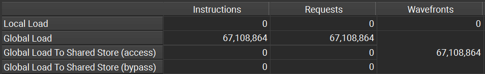

# 矩阵乘法优化笔记

## O、benchmark: cublas
```
nvcc cublas.cu -o cublas -lcublas -lcudart
./cublas
```

```
Time elapsed on `cublas` of 1024x1024 @ 1024x1024 on GPU: 0.200294 ms.
```

## 一、global memory
`matmul_v0`相对于`matmul`的优化在于对 global memory 的读取顺序。global memory 的读取合并可以参考[这里](https://chiemon.github.io/2020/02/06/CUDA-%E7%9F%A9%E9%98%B5%E4%B9%98%E6%B3%95-%E4%BC%98%E5%8C%96%E5%8F%8A%E6%80%A7%E8%83%BD%E5%88%86%E6%9E%90-%E4%B8%8A.html)。

`matmul` 的 block 和 grid 组织按照行优先，使得相邻 thread 对 global memory 的读取无法合并，下面是两个 kernel profile 的结果，可以看出二者对 global memory 的 instructions 和 Requests 完全相同，但是 Wavefronts 却相差接近8倍左右（相邻 8 个 float 的读取会被合并）。profile 中具体参数含义可以参考[官网](https://docs.nvidia.com/nsight-compute/ProfilingGuide/index.html#metrics-decoder)。

<div align="center">



</div>

```
Time elapsed on `matmul` of 1024x1024 @ 1024x1024 on GPU: 15.338086 ms

Time elapsed on `matmul_v0` of 1024x1024 @ 1024x1024 on GPU: 1.740595 ms.
```

## 二、shared memory
`matmul_v1` 的优化在于减少了对 global memory 的重复读取，而是预先读取一部分到 shared memory 中，将重复读取发生在 shared memory 上，而后者的读写速度要比前者快10倍左右，从而提升整体速度。这在 CUDA 变成里也称为 Tiling 技术。

从下图的 profile 结果来看，对 global memory 的访问降低了 **32 倍**左右，这是由于 BLOCK_SIZE 和 TILE_SIZE 均设置为 32。shared memory 的请求则较为频繁。

> 在计算输出矩阵的 (i,j) 元素时，对应 thread 会分别从 A 矩阵的第 i 行和 B 矩阵的第 j 列分别读入 32 个元素到 shared memory 中。由于 shared memory 是 block 共享的，因此该线程读入的 row/col 方向的元素会分别被该 block(32x32) 中 col/row 方向的 32 个 threads 共用。

<div align="center">


</div>

```
Time elapsed on `matmul_v1` of 1024x1024 @ 1024x1024 on GPU: 1.465549 ms.
```

*ATTENTION:*
* TILE_SIZE 需要比 BLOCK_SIZE 小，否则根据判断逻辑会丢失元素
* 对 shared memory 的读写之后需要同步 `__syncthreads();`

## 三、register

### 1、base
与 `shared memory` 的想法类似，orginal 的版本是直接用 register 预存 global memory 中数据。由于 register 只对当前线程可见，为了实现类似 `shared memory` 中的重复读取，单个线程就要计算多个矩阵乘法值，这里假设是 `TM x TN`（读取矩阵 A 的 TM 行和矩阵 B 的 TN 列）。

```
Time elapsed on `matmul_v2_origin` of 1024x1024 @ 1024x1024 on GPU: 0.587366 ms.
```

可以看出，寄存器的读取优化能带来更快的运行速度。这里的实现基于“单个线程计算更多的矩阵元素”的思路：BLOCK_SIZE x BLOCK_SIZE 的线程能计算 BLOCK_SIZE x BLOCK_SIZE x TM x TN 的矩阵元素，使得整体使用的 threads 变少了。所以一个容易想到的优化之处在于：增加使用的资源（threads）。不过在此之前，origin 版本还可以优化，其对 global memory 的读取有明显的离散化（间隔 TM/TN 读取），相邻线程并不对相邻内存进行读取。base 版本利用 stride 方法解决了这个问题。

```
Time elapsed on `matmul_v2_base` of 1024x1024 @ 1024x1024 on GPU: 0.567501 ms.
```

*ATTENTION:*
* register 的加入可能会使得 block/grid 中产生空闲线程，注意提前 return 或正确设置 size，否则会较严重影响速度（1ms->4ms）
* 两个辅助预存数组 `reg_A/reg_B` 是减少读内存的关键

### 2、w/t shared memory
register 和 shared memory 的结合，本质上是二次分块。通过 shared memory 的 Tiling 分成 `TILE_SIZE x TILE_SIZE` 的块，再通过 register 分成更小的 `TM x TN` 的块。

在 shared memory 上不需要考虑 global memory 类似的合并读取的限制，但是需要考虑 **[bank conflict](https://docs.nvidia.com/cuda/cuda-c-programming-guide/#shared-memory-5-x-examples-of-strided-shared-memory-accesses)**。shared memory 按照 4 Bytes 分为一个 bank，在目前计算能力的 GPU 中，shared memory 中一般最多有 32 个bank。

*bank 机制：* 每个 bank 的宽度固定为 32bit，相邻的 32bit 字被组织在相邻的bank中，每个 bank 在每个时钟周期可以提供 32bit 的带宽。

从这个角度看的话，base 版本采用的让相邻 thread 读取相邻的数据这一策略依然适用。在测试程序中，由于 `BLOCK_SIZE=TILE_SIZE=32`，因此只有在同一时间线 `threadIdx.y` 相同时，才会发生 bank conflict，测试程序的设置碰巧不会发生冲突（如果会发生，采用 stride 策略让线程读取连续即可减少冲突）。

```
Time elapsed on `matmul_v2` of 1024x1024 @ 1024x1024 on GPU: 0.563814 ms.
```

*ATTENTION:*
* register 的加入会使得 block/grid 中产生空闲线程，同上。
* register 的实现是用了更少的资源 grid(N/(BLOCK_SIZE * TN), M/(BLOCK_SIZE * TM)) 进行了更多的计算，事实上如果能用与之前同等的资源 grid(TN/BLOCK_SIZE, M/BLOCK_SIZE)，其性能提升不容小觑。其主要思想是，数据的读取用之前相等的线程资源，而计算则还是用少数线程计算，这样避免了 for 循环读取 global memory 的过程。

## 四、float4 读取

SASS代码中的 LDS.128，可以一次加载 128bit 数据，是一种更高效的数据类型，4 次对连续的 float 数据的读取可以合并为一次 LDS.128 操作，极大减少访存频率。在 CUDA 代码中，使用 float4 数据类型即可编译为 LDS.128。该数据类型，对 global memory 和 shared memory 都适用。

`matmul_v3` 实现了利用 float4 优化 load 操作的矩阵乘法。由于希望从 `ds_A/B` 读取到寄存器时，采用 float4 优化，按照读取逻辑的顺序，需要将 `ds_A` 进行转置才能实现。因此可以通过一个临时的 `tmp[4]` 数组暂存 `d_A` 通过 float4 load 的数据，然后按照转置的方式写入 ds_A 中。`ds_B` 则不需要转置。

为了能够使用 float4 类型，设置 `TM=TN=4`，此时 shared memory + register 优化的矩阵乘时间为 `0.572416 ms`，float4 优化后时间为：

```
Time elapsed on `matmul_v3` of 1024x1024 @ 1024x1024 on GPU: 0.472883 ms.
```


