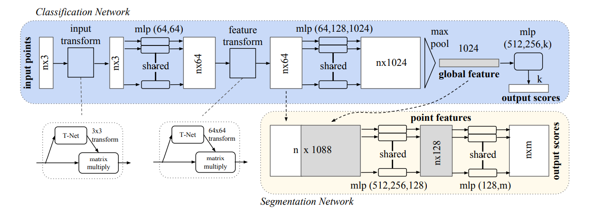

# Analysis of the Model structure

In our 3D MINST recognition task, PointNet is the base model to be implemented in CUDA. 

See related code in `CUDA-NN/python/model.py`. 

## Overview



In this proj, the blue classification net is what we concentrate on. Overall, the model is constructed by 2 parts including:
* Feature Encoder: extract feature from point cloud by point alignment, pooling etc.
* Classification Head: a couple of Linears.

## Feature Encoder

Consisting 3 steps:
* predict the transform matrix(Bx3x3) to align the points (BxNx3): output
* After raising dimension by Conv1d (BxNx64) (with 64 conv kernel), predict the transform matrix (Bx64x64) **once more** to align the feature.
* Raising dimension to (BxNx1024) and max pooling to (Bx1024).

## Classificaton Head

Consisting of several Linear and auxiliary layers:

```
self.fc1 = nn.Linear(1024, 512)
self.fc2 = nn.Linear(512, 256)
self.fc3 = nn.Linear(256, k)
self.dropout = nn.Dropout(p=0.4)
self.bn1 = nn.BatchNorm1d(512)
self.bn2 = nn.BatchNorm1d(256)
self.relu = nn.ReLU()
```


```
# Forward: x(Bx1024) is the output of Feature Encoder
x = F.relu(self.bn1(self.fc1(x)))
x = F.relu(self.bn2(self.dropout(self.fc2(x))))
x = self.fc3(x)
x = F.log_softmax(x, dim=1)
# output: x(Bxk) (k classes)
```

## Loss

Loss contains 2 parts:
* NLL: to measure the classification error
* trans_feat regularization: regularize the feature transformation matrix
    * trans.shape: (Bx64x64) 
    * reg() = torch.mean(torch.norm(torch.bmm(trans, trans.transpose(2,1)) - I, dim(1,2)))

## Conclusion

Matrix operations involved:
* Transpose
* General Matmul
* Batch Matmul
* Reduce(max, mean)

Layer involved:
* Linear
* Conv1d
* BatchNorm1d
* MaxPool
* ReLU
* Sigmoid
* Dropout(training)

However, to reduce the launch cost of the kernel, some layers can be merged.

